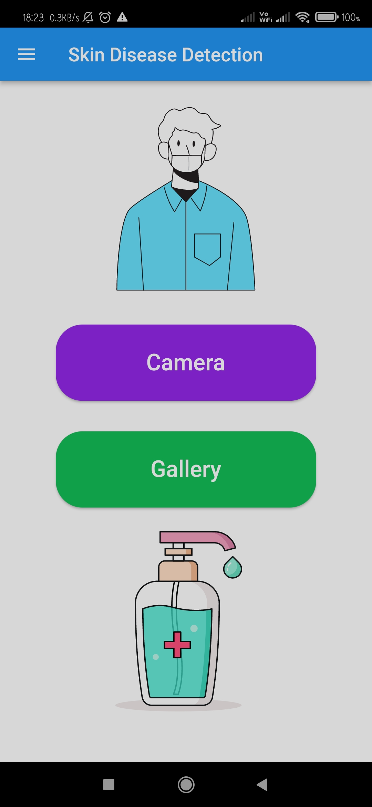
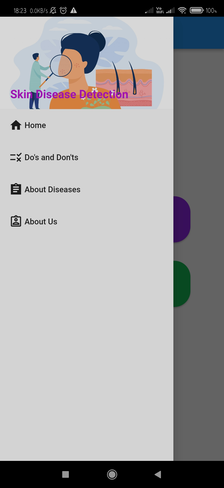
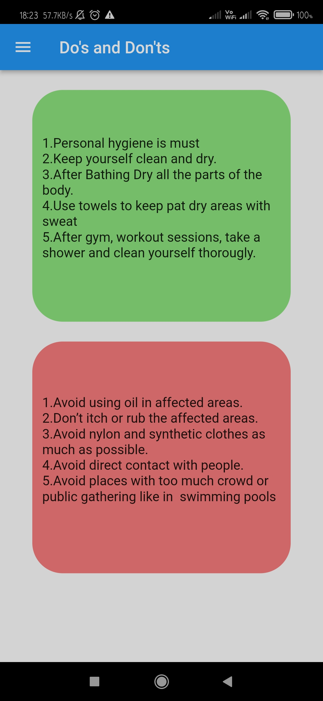
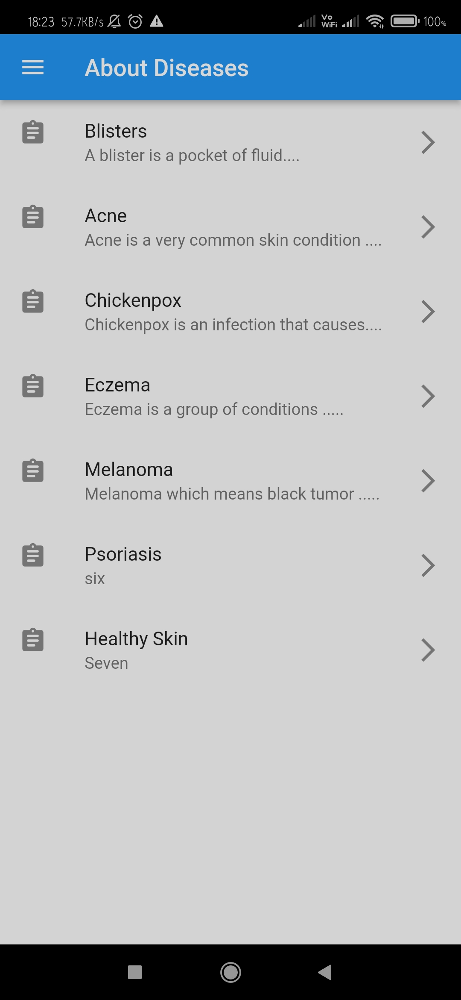
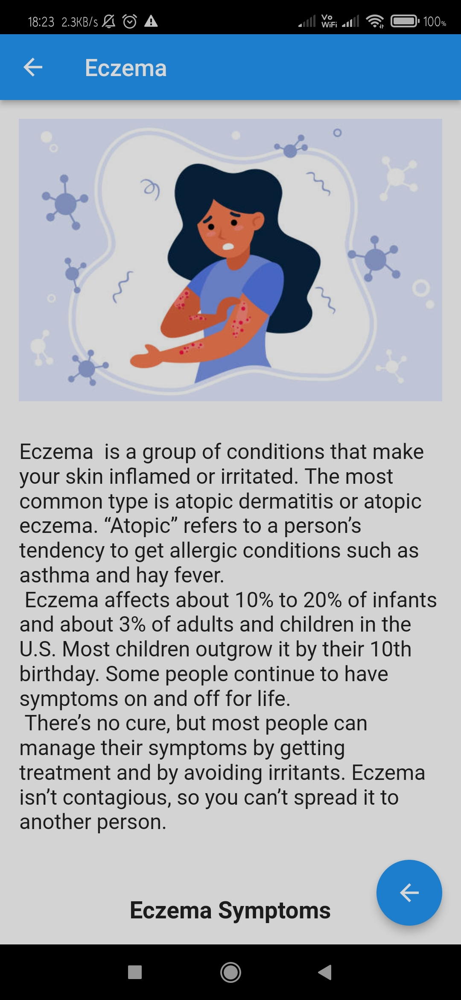
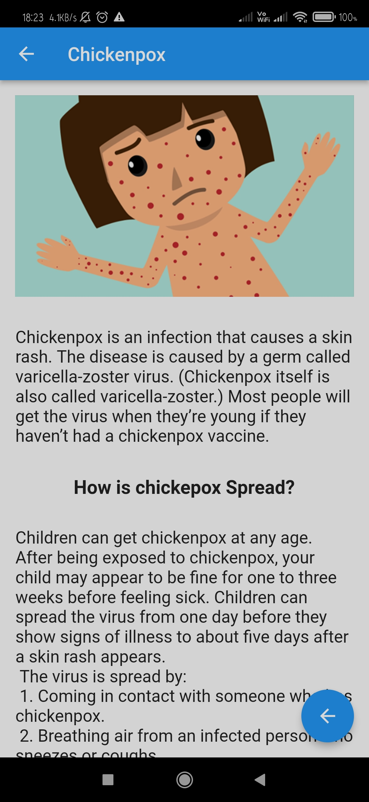
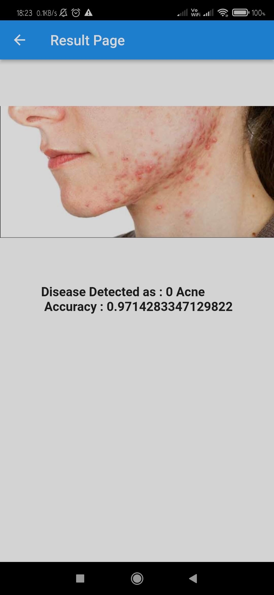

# Skin Disease Detection App

## Problem Statement
Skin diseases are a common issue among all age groups. Lack of awareness may cause huge damage to the physical and mental state of the patient. 

There is a very high miss-match between the skin patient and the doctors required to manage them. 

So, It is important to detect skin conditions and get them cured.

 People from rural areas or busy people from urban areas can use an app to detect their skin condition with the help of Artificial Intelligence. 
This gives them a portable and effective detection method at their place. This solution also helps people to prevent getting infected with problems like skin cancer.

## Objectives

Objective
Below are the goals that the author is trying to achieve.
- To make an app to detect images through the
camera and gallery of the smartphone.
- Provide an easy and effective solution to
detect the skin condition of various people.
- Reduce the cost of treatment.
- Aware people about skin diseases and aware
of the ways to prevent them.
- Develop a portable cure to make people's life
easy and normal.
- To improve the lifestyle of people by telling
them about skin diseases.

## Images

Start up Image 1 | Home Screen 2
:---------------|-----------------:
 | 
Drawer Image 3 | Do's and Don't Page 4 :
 | 
About Diseases| About Eczema
|
About Chikenpox| Result Page
|
